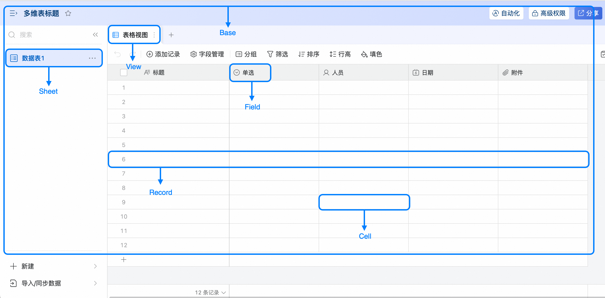

# 核心知识

## 了解AI表格文档对象模型

当需要通过边栏插件执行AI表格的增删改查操作时，应当首先获取到AI表格的对象模型，并调用对象上的方法。

### 常用对象

AI表格的数据对象模型有以下几类：



* **DingdocsScript** 是一个全局对象，可以在模型层直接调用，包含 **Base**、**Sheet**、**View**、**Field**、**Record**等对象

*   **Base**：AI表格。可包含多个数据表，为整个AI表格的顶级对象。在边栏插件中，通过引用变量DingdocsScript.base获取。
    
*   **Sheet**: 数据表。包含多个视图、字段、记录。可通过Base API获取到具体某个Sheet对象。
    
*   **View**: 视图。可通过Sheet API 获取到某个数据表的具体某个View对象。
    
*   **Field**: 字段。可通过Sheet API 获取到某个数据表的具体某个Field对象。
    
*   **Record**: 记录。可通过Sheet API 获取到某个数据表的具体某个Record对象。
    

### 基本使用方法

首先确定要操作的对象，再调该对象上的API。

例如，获取当前查看的数据表，并新增一条标题为“测试用例”的记录，需要先通过Base API获取到当前激活的Sheet对象，再调用Sheet对象的insertRecordAsync API插入行数据。

```typescript
// 获取当前激活的数据表
const sheet = Base.getActiveSheet();
// 向这个数据表中新增一条标题为“测试用例”的记录
await sheet.insertRecordAsync({
  fields: {
    "标题": "测试用例"，
  },
});
```